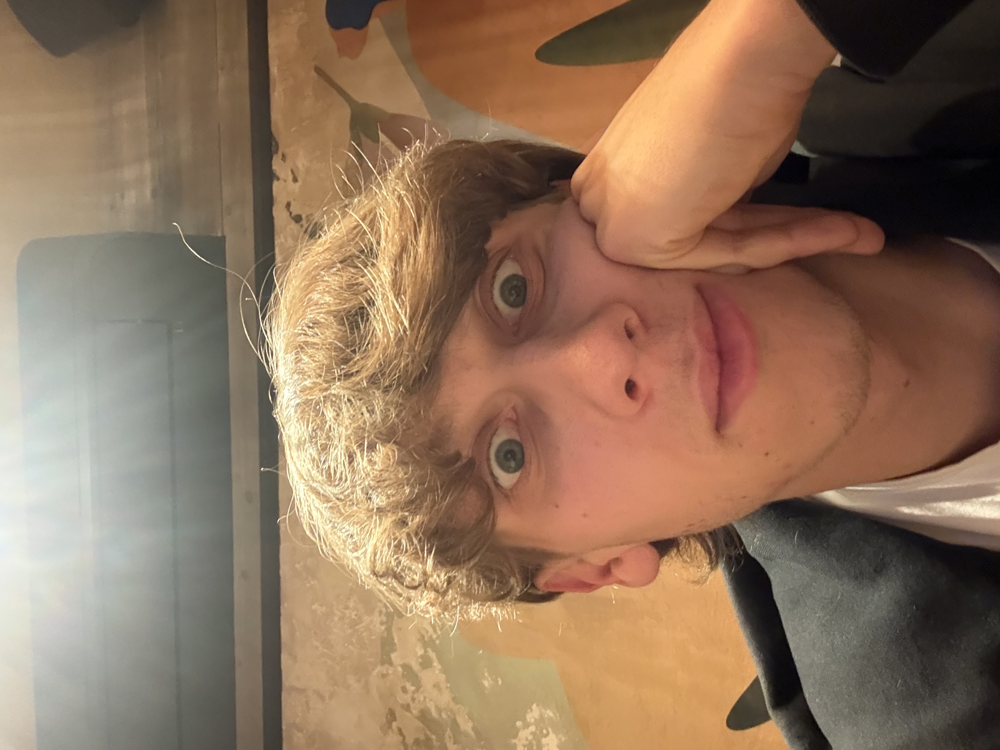

## Hi there 👋

<!--
**artiomsigal/artiomsigal** is a ✨ _special_ ✨ repository because its `README.md` (this file) appears on your GitHub profile.

Here are some ideas to get you started:

- 🔭 I’m currently working on ...
- 🌱 I’m currently learning ...
- 👯 I’m looking to collaborate on ...
- 🤔 I’m looking for help with ...
- 💬 Ask me about ...
- 📫 How to reach me: ...
- 😄 Pronouns: ...
- ⚡ Fun fact: ...
-->
# Привет! 👋

## Кратко обо мне
Я учусь на 2 курсе в университете, на факультете прикладной информатики, изучаю языки программирования, также играю в футбол.

## Области интересов
- Информатика
- Спорт
- Автомобили

## Языки программирования
с++; phyton; html/css; и тд
### Знаю
- Математику
- Информатику

### Изучаю
- Различные предметы в университете
- Дополнительную информацию

### Хочу изучить
- Больше языков программирования
- Предпринимательство

## Как со мной связаться
- Email: artiomsigal@gmail.com
- Telegram: tiomasg
